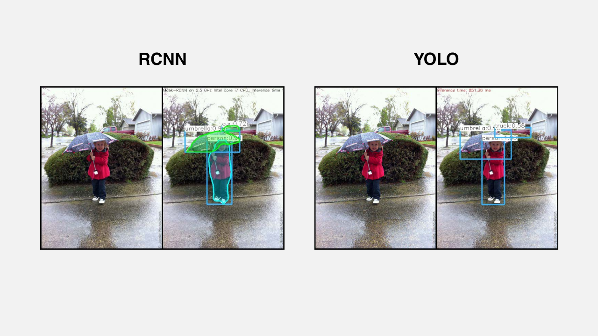
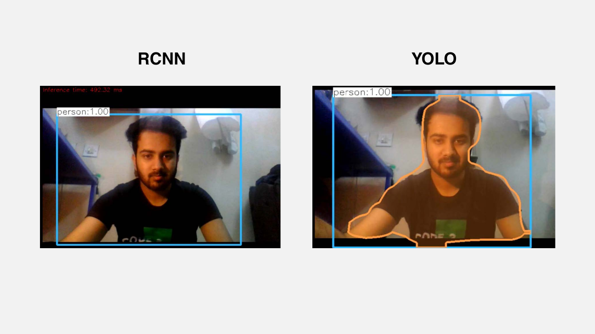
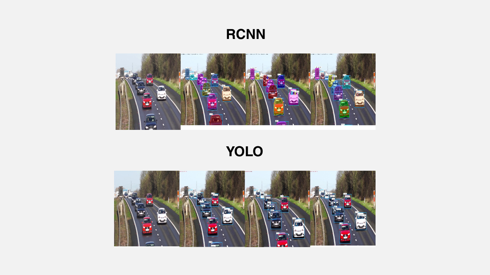

# Object-Detection-RCNNvsYOLO

Implemented two approaches for image object detection – RCNN and YOLO. RCNN features were fed into a support vector machine. In YOLO, the predictor was enhanced by multiple bounding boxes. These models were trained on 'Coco Dataset' to improve accuracy. Presented a comparative analysis between the two approaches for three use cases.

## Comparison

<!---
Photo Still Compare
-->

<!---
Photo Video Compare
-->

<!---
WebCam Compare
-->

